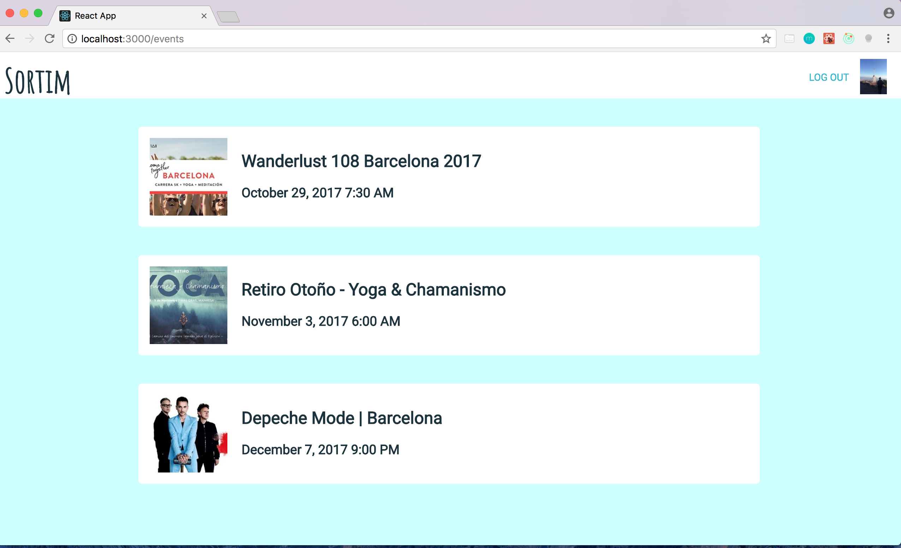

# Sortim front-end

Web app to connect users who are interested in the same Facebook events as them.

## Installation

- Fork and clone the repository
- Run `npm install`
- Create a new Facebook app [here](https://developers.facebook.com/)
- Create a dotenv file with APP_ID set to your new Facebook app ID
- Run `npm start` from the sortim-app folder inside the repository
- Fork and clone Sortim-back-end repository [here](https://github.com/annacollins85/Sortim-back-end) and follow installation instructions

## Tech Stack

This app has been created using

- [React.js](https://reactjs.org/)
- [Redux](http://redux.js.org/)
- [Facebook Api](https://developers.facebook.com/docs/javascript)

## Contributors

We love pull requests from everyone. By participating in this project, you agree to abide by the thoughtbot code of conduct: [thoughtbot.com/open-source-code-of-conduct](https://thoughtbot.com/open-source-code-of-conduct)

Fork, then clone the repository. Push to your fork and submit a pull request.

## License

'Sortim' is licensed under the [MIT](http://www.opensource.org/licenses/mit-license.php) license.

